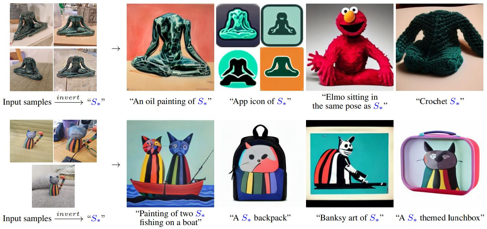
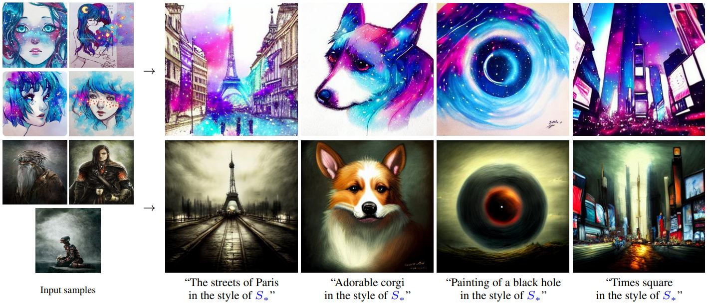

# An Image is Worth One Word: Personalizing Text-to-Image Generation using Textual Inversion

[[Project Website](https://textual-inversion.github.io/)]

> **An Image is Worth One Word: Personalizing Text-to-Image Generation using Textual Inversion** 
> Rinon Gal1,2, Yuval Alaluf1, Yuval Atzmon2, Or Patashnik1, Amit H. Bermano1, Gal Chechik2, Daniel Cohen-Or1  
> 1Tel Aviv University, 2NVIDIA

>**Abstract**:  
> Text-to-image models offer unprecedented freedom to guide creation through natural language.
  Yet, it is unclear how such freedom can be exercised to generate images of specific unique concepts, modify their appearance, or compose them in new roles and novel scenes.
  In other words, we ask: how can we use language-guided models to turn <i>our</i> cat into a painting, or imagine a new product based on <i>our</i> favorite toy?
  Here we present a simple approach that allows such creative freedom.
  Using only 3-5 images of a user-provided concept, like an object or a style, we learn to represent it through new "words" in the embedding space of a frozen text-to-image model.
  These "words" can be composed into natural language sentences, guiding <i>personalized</i> creation in an intuitive way.
  Notably, we find evidence that a <i>single</i> word embedding is sufficient for capturing unique and varied concepts.
  We compare our approach to a wide range of baselines, and demonstrate that it can more faithfully portray the concepts across a range of applications and tasks.

## Description
This repo will contain the official code, data and sample inversions for our Textual Inversion paper. We are waiting for a final approval, but expect the code to be available by the end of the month.
An inference demo with pre-inverted concepts will be available within the same time-frame.

In the meantime, here are some results. Please visit our [project page](https://textual-inversion.github.io/) or read our paper for more!

